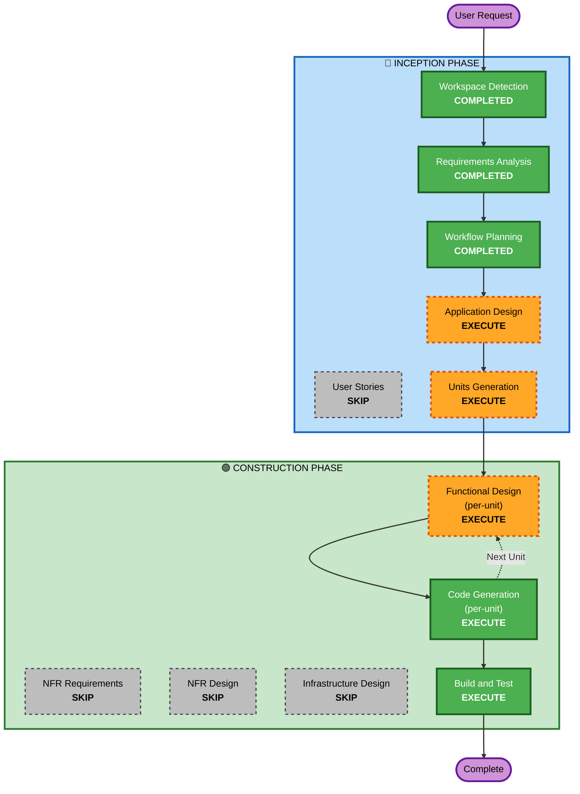

# Execution Plan

## Detailed Analysis Summary

### Change Impact Assessment
- **User-facing changes**: Yes — 고객 주문 UI + 관리자 대시보드 전체 신규 구축
- **Structural changes**: Yes — 전체 시스템 아키텍처 신규 설계 (FastAPI + React + PostgreSQL)
- **Data model changes**: Yes — 9개 핵심 엔티티 신규 설계
- **API changes**: Yes — 전체 REST API + SSE 엔드포인트 신규 설계
- **NFR impact**: Yes — SSE 실시간 통신, JWT 인증, 세션 관리 (단, MVP 수준)

### Risk Assessment
- **Risk Level**: Medium
- **Rollback Complexity**: Easy (신규 프로젝트, 기존 시스템 영향 없음)
- **Testing Complexity**: Moderate (SSE 실시간 통신, 세션 관리 테스트 필요)

---

## Workflow Visualization



### Text Alternative
```
Phase 1: INCEPTION
  - Workspace Detection      (COMPLETED)
  - Requirements Analysis     (COMPLETED)
  - User Stories              (SKIP)
  - Workflow Planning         (COMPLETED)
  - Application Design        (EXECUTE)
  - Units Generation          (EXECUTE)

Phase 2: CONSTRUCTION (per-unit loop)
  - Functional Design         (EXECUTE, per-unit)
  - NFR Requirements          (SKIP)
  - NFR Design                (SKIP)
  - Infrastructure Design     (SKIP)
  - Code Generation           (EXECUTE, per-unit)
  - Build and Test            (EXECUTE)
```

---

## Phases to Execute

### 🔵 INCEPTION PHASE
- [x] Workspace Detection (COMPLETED)
- [x] Requirements Analysis (COMPLETED)
- [x] User Stories — **SKIP**
  - **Rationale**: 요구사항 문서가 이미 상세하며, 사용자가 User Stories 추가를 선택하지 않음
- [x] Workflow Planning (COMPLETED)
- [ ] Application Design — **EXECUTE**
  - **Rationale**: 전체 시스템 신규 설계. 컴포넌트 식별, 서비스 레이어, 비즈니스 규칙 정의 필요
- [ ] Units Generation — **EXECUTE**
  - **Rationale**: 프론트엔드(React) + 백엔드(FastAPI) + DB 스키마 등 다중 모듈 분해 필요

### 🟢 CONSTRUCTION PHASE
- [ ] Functional Design — **EXECUTE** (per-unit)
  - **Rationale**: 복잡한 비즈니스 로직 존재 (세션 관리, 주문 상태 머신, SSE 이벤트 흐름, 장바구니 로직)
- [ ] NFR Requirements — **SKIP**
  - **Rationale**: Security/PBT 확장 비활성, 로컬 Docker Compose 배포, MVP 수준으로 별도 NFR 분석 불필요
- [ ] NFR Design — **SKIP**
  - **Rationale**: NFR Requirements 스킵이므로 NFR Design도 스킵
- [ ] Infrastructure Design — **SKIP**
  - **Rationale**: Docker Compose 로컬 배포로 클라우드 인프라 설계 불필요. Docker 설정은 Code Generation에서 처리
- [ ] Code Generation — **EXECUTE** (per-unit)
  - **Rationale**: 전체 애플리케이션 코드 생성 필요
- [ ] Build and Test — **EXECUTE**
  - **Rationale**: 빌드 및 테스트 지침 생성 필요

### 🟡 OPERATIONS PHASE
- [ ] Operations — **PLACEHOLDER**

---

## Execution Summary

| 구분 | 수량 |
|---|---|
| 완료된 단계 | 3 (Workspace Detection, Requirements Analysis, Workflow Planning) |
| 실행 예정 단계 | 5 (Application Design, Units Generation, Functional Design, Code Generation, Build and Test) |
| 스킵 단계 | 5 (User Stories, NFR Requirements, NFR Design, Infrastructure Design, Operations) |

## Success Criteria
- **Primary Goal**: 고객이 테이블에서 메뉴를 조회하고 주문할 수 있으며, 관리자가 실시간으로 주문을 모니터링하고 관리할 수 있는 MVP 서비스
- **Key Deliverables**: FastAPI 백엔드, React 프론트엔드, PostgreSQL 스키마, Docker Compose 설정, 테스트 코드
- **Quality Gates**: 주문 생성/조회 정상 동작, SSE 실시간 업데이트, 관리자 인증, 테이블 세션 관리
